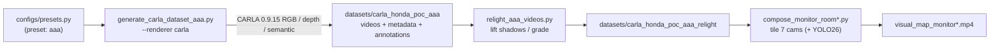

<div align="center">

# 🚗 Honda Smart Car Tracking System — CARLA Dataset Generator

**Synthetic multi-camera CCTV dataset for vehicle re-identification, cross-camera tracking, status classification, and parking-slot detection — built with the CARLA Simulator.**


</div>

---

## 📑 Table of Contents

- [Overview](#-overview)
- [Why This Is Hard](#-why-this-is-hard)
- [Highlights](#-highlights)
- [Pipeline at a Glance](#-pipeline-at-a-glance)
- [Repository Structure](#-repository-structure)
- [Configuration — The Single Source of Truth](#-configuration--the-single-source-of-truth)
- [Camera Network](#-camera-network)
- [Prerequisites](#-prerequisites)
- [Installation](#-installation)
- [Running the CARLA Server](#-running-the-carla-server)
- [Quickstart — Full Pipeline](#-quickstart--full-pipeline)
- [CLI Reference](#-cli-reference)
- [Dataset Outputs & Schemas](#-dataset-outputs--schemas)
- [Validation](#-validation)
- [Troubleshooting](#-troubleshooting)
- [Handoff Notes & Roadmap](#-handoff-notes--roadmap)
- [References](#-references)

---

## 🎯 Overview

This project generates a **synthetic video dataset** for a Proof of Concept of the
**Honda Smart Car Tracking System** (see
[`docs/Proposal_v1_0_Honda_Smart_Car_Tracking_System.md`](docs/Proposal_v1_0_Honda_Smart_Car_Tracking_System.md)).

Freshly manufactured cars leave the production line, travel through a fixed CCTV
network, are classified `GOOD` or `DEFECT` at a junction, and finally park in a
designated slot. The vehicles have **no license plates** and are **visually near-identical**,
so the tracking pipeline must build a unique identity for each car purely from
appearance, geometry, and cross-camera continuity.

We use the **CARLA Simulator 0.9.15** to render photorealistic CCTV footage from
seven virtual fixed cameras, together with frame-accurate ground-truth metadata
(bounding boxes, tracking IDs, status, parking slots, camera/world transforms) for
training and validating detectors, trackers, status classifiers, and parking logic.

> [!IMPORTANT]
> **The canonical generator is [`scripts/generate_carla_dataset_aaa.py`](scripts/generate_carla_dataset_aaa.py).**
> It produced the delivered dataset (`datasets/carla_honda_poc_aaa_relight`). The
> scripts `generate_carla_dataset.py` and `generate_carla_dataset_realistic.py` are
> earlier iterations, kept only for reference.

> [!TIP]
> **Every tunable setting lives in one file: [`configs/presets.py`](configs/presets.py)** — map,
> weather, camera angles, FOVs, vehicle model, car colors, resolution, fps, and more,
> grouped under the named preset **`aaa`**. Edit that one file to retune, or copy the
> preset to spin up a new dataset variant. See
> [Configuration](#-configuration--the-single-source-of-truth).

---

## 🧩 Why This Is Hard

| Challenge | How the dataset addresses it |
|---|---|
| Cars look identical, no plates | Near-white color palette on one shared vehicle model → forces appearance-agnostic re-ID |
| Identity must persist across cameras | 7-camera network with overlapping route timing and ground-truth `tracking_id` |
| Status is inferred from behavior | Junction camera encodes the rule **left turn = `GOOD`, right turn = `DEFECT`** |
| Final location matters | Each car ends in a labeled parking slot (`G01–G06`, `D01–D04`) |
| Detectors need real supervision | Per-frame 2D boxes are projected from true 3D geometry, filtered by depth + semantic visibility |

---

## ✨ Highlights

- **7 fixed CCTV cameras** rendered from real CARLA RGB sensors at **1920×1080 / 20 fps**.
- **Ground-truth bounding boxes** projected from 3D vehicle geometry and cross-checked against
  depth and semantic-segmentation sensors — no hand labels, no drift.
- **Deterministic & reproducible**: a single `--random-seed` reproduces the exact dataset.
- **Cinematic "AAA" CCTV look**: filmic tone map, bloom, vignette, scanlines, deterministic
  grain, and a `REC` timestamp overlay — plus an optional natural **relight** pass.
- **Monitor-room composites**: all seven feeds tiled onto one operator screen, optionally with
  **YOLO26 tracking** overlays.
- **One config file** captures the entire setup as a reusable, named preset.

---

## 🔭 Pipeline at a Glance



**Route flow captured by the camera network:**

```text
CAM_01_START → CAM_02_TRANSIT → CAM_03_JUNCTION_STATUS ┬─ (left / GOOD)   → CAM_04_GOOD_ROUTE   → CAM_06_GOOD_PARKING
                                                       └─ (right / DEFECT) → CAM_05_DEFECT_ROUTE → CAM_07_DEFECT_PARKING
```

---

## 📁 Repository Structure

```text
.
├── README.md
├── requirements.txt
├── configs/
│   └── presets.py                              # ⭐ ALL dataset setup lives here (preset "aaa")
├── scripts/
│   ├── generate_carla_dataset_aaa.py           # ⭐ Canonical generator — use this one
│   ├── relight_aaa_videos.py                   # Post: natural shadow-lift / color grade
│   ├── compose_monitor_room.py                 # Post: tile 7 cameras into one monitor feed
│   ├── compose_monitor_room_yolo_tracking.py   # Post: monitor feed + YOLO26 tracking overlay
│   ├── generate_carla_dataset.py               # Legacy iteration (reference only)
│   └── generate_carla_dataset_realistic.py     # Legacy iteration (reference only)
├── docs/
│   ├── Proposal_v1_0_Honda_Smart_Car_Tracking_System.md
│   └── aaa/                                     # Generated map, dataset doc, contact sheets
├── datasets/                                    # Generated artifacts (git-ignored)
│   ├── carla_honda_poc_aaa/                     # Raw generator output
│   └── carla_honda_poc_aaa_relight/             # Relit videos + monitor composites (delivered)
│       ├── videos/
│       ├── metadata/
│       └── annotations/
├── yolo26n.pt / yolo26m.pt                      # YOLO weights for the tracking composite
└── .gitignore
```

> [!NOTE]
> `datasets/`, `docs/video_contact_sheets/`, `tmp/`, and `__pycache__/` are git-ignored — the
> videos and annotations are large, reproducible artifacts, not source.

---

## ⚙️ Configuration — The Single Source of Truth

All values that were previously hard-coded across the generator now live in one place:
**[`configs/presets.py`](configs/presets.py)**. A `DatasetConfig` dataclass named **`aaa`**
holds the complete, reproducible setup for the delivered dataset.

### What the preset controls

| Group | Fields |
|---|---|
| **Output** | `output_dir`, `docs_dir` |
| **Scene** | `carla_map`, `weather` (cloudiness, sun altitude/azimuth, fog, wetness, scattering…) |
| **Render** | `fps`, `duration_sec`, `width`, `height`, `random_seed`, `num_cars`, `cctv_grain_strength`, `temporal_blend_strength` |
| **Cameras** | `camera_plan` (per-camera yaw offset / distance / height), `camera_fovs`, `rgb_sensor_attributes` (exposure, gamma, bloom, ISO, shutter, f-stop…) |
| **Vehicles** | `vehicle_blueprints` (CARLA model), `car_colors_bgr`, `speed_factor_*`, `start_offset_range_sec` |

### How presets are used

The generator selects a preset via `--preset` (default `aaa`, which **reproduces the delivered
dataset exactly**). Any CLI flag that overlaps a preset value (e.g. `--fps`, `--width`,
`--num-cars`) **overrides** the preset for that single run.

### Create a new dataset variant

1. Copy the `AAA = DatasetConfig(...)` block in `configs/presets.py`.
2. Rename it and edit the values you want (e.g. a rainy night, a different map, tighter FOVs).
3. Register it in the `PRESETS` dict, e.g. `PRESETS = {"aaa": AAA, "rainy_night": RAINY_NIGHT}`.
4. Generate with `--preset rainy_night`.

### Self-check

The preset file ships with an assertion-based self-check that **locks the delivered values** so
an accidental edit is caught immediately:

```bash
python configs/presets.py     # → "presets self-check OK"
```

> [!NOTE]
> **Structural logic stays in code, not config.** Route topology, the junction
> `GOOD`/`DEFECT` rule, and parking-slot assignment are algorithmic decisions inside the
> generator — changing them is a code change, not a config tweak, so they are intentionally
> not exposed as preset fields.

---

## 🎥 Camera Network

The dataset uses seven fixed CCTV cameras. The status rule is enforced at the junction camera.

| Camera ID | Name | Purpose | Parking slots |
|---|---|---|---|
| `CAM_01_START` | Start | Detect vehicles exiting the production line | — |
| `CAM_02_TRANSIT` | Transit Route | Cross-camera tracking from start to junction | — |
| `CAM_03_JUNCTION_STATUS` | Junction Status | Classify status by turn: **left = `GOOD`, right = `DEFECT`** | — |
| `CAM_04_GOOD_ROUTE` | Good Route | Route segment for `GOOD` vehicles | — |
| `CAM_05_DEFECT_ROUTE` | Defect Route | Route segment for `DEFECT` vehicles | — |
| `CAM_06_GOOD_PARKING` | Good Parking | Parking-slot detection for `GOOD` vehicles | `G01`–`G06` |
| `CAM_07_DEFECT_PARKING` | Defect Parking | Parking-slot detection for `DEFECT` vehicles | `D01`–`D04` |

**Vehicle identity fields:** `tracking_id` (e.g. `TRK_0001`), `status` (`GOOD` / `DEFECT`),
`parking_slot_id` (e.g. `G01`, `D01`).

---

## 🧰 Prerequisites

### Hardware

- NVIDIA GPU with **≥ 8 GB VRAM** (validated on a Tesla V100 16 GB)
- Docker with the **NVIDIA Container Toolkit**
- Ample disk space for rendered video output

### Software

- Linux host
- Docker + NVIDIA driver with **graphics/Vulkan** capability (not just compute)
- **Python 3.10** for the CARLA 0.9.15 client (via Conda or a virtualenv)
- CARLA Docker image `carlasim/carla:0.9.15`

> [!WARNING]
> Do **not** use Python 3.13 for the CARLA 0.9.15 client — the wheel/API compatibility is
> unreliable. Pin the client environment to Python 3.10.

### Python dependencies (`requirements.txt`)

```text
opencv-python>=4.8
numpy>=1.24
Pillow>=10.0
carla==0.9.15; python_version < "3.11"
ultralytics>=8.3.0      # only needed for the YOLO26 monitor composite
tqdm>=4.66.0
```

---

## 📦 Installation

**1. Clone the project**

```bash
git clone <repo-url>
cd carla-smart-car-tracking-sim
```

**2. Create the Python environment (CARLA client is Python 3.10)**

```bash
conda create -n carla-0915 python=3.10 -y
conda activate carla-0915
python -m pip install --upgrade pip
pip install -r requirements.txt
```

> If `pip install carla==0.9.15` fails, install the CARLA Python API from the egg/wheel shipped
> with the matching CARLA 0.9.15 release instead (must match your Python version).

**3. Pull the CARLA Docker image**

```bash
docker pull carlasim/carla:0.9.15
```

**4. Verify NVIDIA + Docker**

```bash
docker run --rm --gpus all \
  -e NVIDIA_DRIVER_CAPABILITIES=compute,utility,graphics \
  nvidia/cuda:12.4.1-base-ubuntu22.04 nvidia-smi
```

> [!NOTE]
> On headless VMs, avoid the `display` capability — the NVIDIA runtime tries to mount
> `/dev/nvidia-modeset`, which may not exist and will fail container init. Use
> `compute,utility,graphics`.

---

## 🖥️ Running the CARLA Server

In the **first terminal**, start the CARLA server (headless / off-screen):

```bash
docker run --rm -it \
  --privileged \
  --gpus '"device=0"' \
  --net=host \
  -e NVIDIA_DRIVER_CAPABILITIES=compute,utility,graphics \
  carlasim/carla:0.9.15 \
  /bin/bash ./CarlaUE4.sh -RenderOffScreen -quality-level=Low -carla-rpc-port=2000 -nosound -NoSound
```

- Use `-RenderOffScreen` for VM/headless servers.
- For maximum shadow and texture quality, swap in `-quality-level=Epic`.

> [!CAUTION]
> **Never use `-no-rendering`** for this project — the camera/GPU sensors produce blank frames
> and no video dataset can be generated. Use `-RenderOffScreen` instead.

**Verify the client connection** (second terminal):

```bash
conda activate carla-0915
python - <<'PY'
import carla
client = carla.Client("127.0.0.1", 2000)
client.set_timeout(10.0)
print("client:", client.get_client_version())
print("server:", client.get_server_version())
world = client.load_world("Town05_Opt")   # fall back to "Town05" if "_Opt" is absent
print("map:", world.get_map().name)
PY
```

---

## 🚀 Quickstart — Full Pipeline

The full pipeline is three stages. Stage 1 requires a running CARLA server; stages 2–3 are pure
video post-processing (no CARLA needed).

### Stage 1 — Generate the raw AAA CCTV dataset

```bash
python scripts/generate_carla_dataset_aaa.py --renderer carla --clean
```

Produces `datasets/carla_honda_poc_aaa/` (7 camera videos + metadata + annotations). Defaults
come from the **`aaa`** preset: `fps 20`, `num-cars 6`, `duration-sec 60`, `1920×1080`,
`carla-map Town05_Opt`, `random-seed 7`.

Override per run as needed:

```bash
python scripts/generate_carla_dataset_aaa.py \
  --renderer carla --preset aaa \
  --num-cars 6 --fps 20 --width 1920 --height 1080 \
  --write-contact-sheets --clean
```

**Dry-run without CARLA** (metadata / camera-graph sanity check only — *not* a real dataset):

```bash
python scripts/generate_carla_dataset_aaa.py --renderer storyboard --clean
```

### Stage 2 — Relight

Naturally lift shadows/midtones and grade the footage, writing to the `_relight` dataset:

```bash
python scripts/relight_aaa_videos.py \
  --input-dir datasets/carla_honda_poc_aaa \
  --output-dir datasets/carla_honda_poc_aaa_relight \
  --preset balanced
```

Relight presets (`--preset`): `subtle`, `balanced` (delivered), `stronger`. Individual knobs
(`--shadow-lift`, `--midtone-lift`, `--highlight-protect`, `--warmth`, `--saturation`,
`--local-contrast`) override the preset. The delivered grade was:

```json
{ "shadow_lift": 0.155, "midtone_lift": 0.075, "highlight_protect": 0.82,
  "warmth": 0.014, "saturation": 1.025, "local_contrast": 0.28, "denoise": false }
```

### Stage 3 — Compose the monitor room

Tile all seven feeds onto a single operator screen:

```bash
# Plain monitor; add --show-bboxes to draw ground-truth boxes from annotations
python scripts/compose_monitor_room.py

# Monitor + YOLO26 detection/tracking overlay
python scripts/compose_monitor_room_yolo_tracking.py --yolo-model yolo26m.pt
```

Outputs land in `datasets/carla_honda_poc_aaa_relight/videos/visual_map_monitor*.mp4`.

### Resume / re-annotate (recovery workflows)

```bash
# Re-render only specific cameras after a CARLA crash, appending annotations
python scripts/generate_carla_dataset_aaa.py --renderer carla \
  --camera-ids CAM_03_JUNCTION_STATUS,CAM_05_DEFECT_ROUTE --append-annotations

# Re-project bounding boxes against a running CARLA server WITHOUT re-encoding video
python scripts/generate_carla_dataset_aaa.py --renderer carla --annotations-only
```

---

## 📖 CLI Reference

### `generate_carla_dataset_aaa.py`

```bash
python scripts/generate_carla_dataset_aaa.py --help
```

Flags whose default comes from the active preset are marked **preset** (the delivered `aaa`
value is shown in parentheses).

| Option | Default | Description |
|---|---:|---|
| `--preset` | `aaa` | Named config from `configs/presets.py` |
| `--output-dir` | *preset* | Output directory (`datasets/carla_honda_poc_aaa`) |
| `--docs-dir` | *preset* | Directory for generated map/doc files (`docs/aaa`) |
| `--renderer` | `carla` | `carla` for the real dataset, `storyboard` for a CARLA-free dry-run |
| `--num-cars` | *preset* (6) | Number of vehicles (must be 5–6 for this focused PoC) |
| `--fps` | *preset* (20) | Output video frame rate |
| `--duration-sec` | *preset* (60) | Video length per camera |
| `--width` | *preset* (1920) | Video width |
| `--height` | *preset* (1080) | Video height |
| `--carla-host` | `127.0.0.1` | CARLA server host |
| `--carla-port` | `2000` | CARLA RPC port |
| `--carla-map` | *preset* (Town05_Opt) | CARLA map; falls back to `Town05` if `_Opt` is missing |
| `--carla-timeout-sec` | `120` | CARLA RPC timeout (for slow map loads) |
| `--random-seed` | *preset* (7) | Seed for deterministic 3–5 s start delays |
| `--camera-ids` | all | Comma-separated camera IDs to render (e.g. resume after a crash) |
| `--append-annotations` | off | Append to `annotations/bboxes.jsonl` instead of overwriting (use with `--camera-ids`) |
| `--annotations-only` | off | Re-project boxes from CARLA without re-encoding video |
| `--min-bbox-px` | `4` | Minimum box size (px) kept in `--annotations-only` mode |
| `--cctv-postprocess` | on | Filmic color, bloom, grain, vignette, scanlines, `REC` timestamp |
| `--cctv-grain-strength` | *preset* (1.35) | Per-pixel grain strength |
| `--temporal-stabilization` | on | Slight frame blending to reduce capture flicker |
| `--temporal-blend-strength` | *preset* (0.10) | Frame-to-frame blend strength |
| `--wheel-motion-hints` | on | Per-frame velocity hints for smoother rendered motion |
| `--hide-camera-blockers` | on | Temporarily hide static objects that occlude CAM_02 / CAM_03 |
| `--write-contact-sheets` | off | Sampled per-camera contact sheets under `docs/aaa/video_contact_sheets/` |
| `--clean` | off | Remove the output directory before generating |

### `relight_aaa_videos.py` (key flags)

| Option | Default | Description |
|---|---:|---|
| `--input-dir` / `--output-dir` | `..._aaa` / `..._aaa_relight` | Source and destination datasets |
| `--preset` | `balanced` | `subtle` \| `balanced` \| `stronger` |
| `--shadow-lift` / `--midtone-lift` / `--highlight-protect` | preset | Fine-grained grade overrides |
| `--warmth` / `--saturation` / `--local-contrast` | preset | Tone/color overrides |
| `--max-frames` | `0` | Cap frames for a quick preview (0 = all) |

### `compose_monitor_room_yolo_tracking.py` (key flags)

| Option | Default | Description |
|---|---:|---|
| `--input-dir` / `--output` | `..._relight/videos` | Camera feeds in, composite MP4 out |
| `--yolo-model` | `yolo26m.pt` | Ultralytics model weights |
| `--yolo-conf` / `--yolo-iou` / `--yolo-imgsz` | `0.10` / `0.45` / `1280` | Detection thresholds & input size |
| `--yolo-tracker` | `bytetrack.yaml` | Ultralytics tracker config |
| `--max-frames` | `0` | Cap frames for a quick preview |

---

## 🗂️ Dataset Outputs & Schemas

> [!IMPORTANT]
> The `datasets/` directory is **git-ignored and not shipped in this repository** (the videos
> are multi-GB artifacts). After cloning you will only have code, config, and docs. To obtain the
> dataset, either **regenerate it** with the [full pipeline](#-quickstart--full-pipeline) against a
> running CARLA server, or **request the delivered `carla_honda_poc_aaa_relight` bundle** from the
> handoff owner via a separate file transfer. The schemas below describe what the pipeline emits.

```text
datasets/carla_honda_poc_aaa_relight/            # delivered (post relight + compose)
├── videos/
│   ├── CAM_01_START.mp4 … CAM_07_DEFECT_PARKING.mp4   # 7 camera feeds
│   ├── visual_map_monitor.mp4                   # tiled 7-camera monitor
│   ├── visual_map_monitor_bboxes.mp4            # monitor + ground-truth boxes
│   └── visual_map_monitor_yolo26.mp4            # monitor + YOLO26 tracking
├── metadata/
│   ├── cars.csv
│   ├── camera_graph.json
│   ├── route_plan.json
│   └── events.jsonl
└── annotations/
    └── bboxes.jsonl
```

Generated documentation per preset: `docs/aaa/carla_honda_poc_map.png`,
`docs/aaa/carla_honda_poc_dataset.md`.

### `annotations/bboxes.jsonl` — per-frame ground truth

One JSON object per detected vehicle per frame:

| Field | Type | Description |
|---|---|---|
| `tracking_id` | string | Stable per-vehicle ID (`TRK_0001`) |
| `status` | string | `GOOD` or `DEFECT` |
| `route` | string[] | Ordered camera IDs the vehicle traverses |
| `camera_id` | string | Camera this observation belongs to |
| `frame_id` | int | Frame index within the camera video |
| `carla_frame` | int | CARLA simulation frame number |
| `timestamp_sec` | float | Time within the video |
| `bbox` | int[4] | `[x1, y1, x2, y2]` pixel box |
| `bbox_source` | string | e.g. `carla_3d_projection_depth_visible` |
| `visibility` | object | Depth/semantic evidence: `visible_depth_samples`, `depth_evidence_ratio`, `visibility_fraction`, `actor_depth_m`, … |
| `parking_slot_id` | string | Slot at parking cameras, else `""` |
| `vehicle_actor_id` | int | CARLA actor ID |
| `camera_transform` | object | Camera `location` + `rotation` (world frame) |
| `world_transform` | object | Vehicle `location` + `rotation` (world frame) |

### `metadata/events.jsonl` — per-camera enter/exit events

`tracking_id`, `status`, `camera_id`, `vehicle_actor_id`, `carla_map`, `carla_version`,
`enter_timestamp_sec`, `exit_timestamp_sec`, `parking_slot_id`.

### `metadata/cars.csv` — vehicle roster

`tracking_id`, `status`, `route` (`>`-joined), `parking_slot_id`, `start_offset_sec`, `speed_factor`.

### `metadata/camera_graph.json` & `route_plan.json`

The camera graph records the renderer, visual profile, map, fps, resolution, the junction
`status_rule`, and every camera's transform/FOV/next-camera links. The route plan records the
overall `route_flow` and the per-camera `segment_windows_sec` timing.

---

## ✅ Validation

Inventory the output tree:

```bash
find datasets/carla_honda_poc_aaa_relight -maxdepth 3 -type f | sort
```

Check every video decodes with the expected geometry:

```bash
python - <<'PY'
import cv2
from pathlib import Path
for p in sorted(Path("datasets/carla_honda_poc_aaa_relight/videos").glob("*.mp4")):
    cap = cv2.VideoCapture(str(p))
    frames = int(cap.get(cv2.CAP_PROP_FRAME_COUNT))
    fps = cap.get(cv2.CAP_PROP_FPS)
    w = int(cap.get(cv2.CAP_PROP_FRAME_WIDTH)); h = int(cap.get(cv2.CAP_PROP_FRAME_HEIGHT))
    cap.release()
    print(p.name, frames, fps, f"{w}x{h}")
PY
```

Validate the annotations:

```bash
python - <<'PY'
import json
n = 0
with open("datasets/carla_honda_poc_aaa_relight/annotations/bboxes.jsonl") as fh:
    for line in fh:
        row = json.loads(line)
        x1, y1, x2, y2 = row["bbox"]
        assert x1 < x2 and y1 < y2, row
        n += 1
print("bbox records:", n)
PY
```

Confirm the preset still matches the delivered values:

```bash
python configs/presets.py     # → "presets self-check OK"
```

---

## 🛠️ Troubleshooting

<details>
<summary><strong><code>ERROR: CARLA Python API is not installed</code></strong></summary>

The active environment has no `carla` module. Use the Python 3.10 environment and install it:

```bash
conda activate carla-0915
pip install carla==0.9.15
```

If that still fails, use the Python API egg/wheel shipped with the CARLA 0.9.15 release.
</details>

<details>
<summary><strong>Docker error: <code>/dev/nvidia-modeset: no such file or directory</code></strong></summary>

The host has an NVIDIA compute device but an incomplete graphics stack, or the Docker command
requested `NVIDIA_DRIVER_CAPABILITIES=display` on a headless machine with no display device.

Inspect the host:

```bash
nvidia-smi
ls -l /dev/nvidia*
lsmod | grep nvidia
vulkaninfo --summary
```

You want to see `/dev/nvidia-modeset`, `nvidia_modeset`, and `nvidia_drm`. If this passes:

```bash
docker run --rm --gpus all \
  -e NVIDIA_DRIVER_CAPABILITIES=compute,utility,graphics \
  nvidia/cuda:12.4.1-base-ubuntu22.04 nvidia-smi
```

then run CARLA **without** `display`, using `compute,utility,graphics`. If you genuinely need
`display`, fix the host driver/modules so `/dev/nvidia-modeset` exists — do not patch inside the
container.

On Debian, enable `non-free non-free-firmware` before installing the driver:

```text
deb http://deb.debian.org/debian trixie main contrib non-free non-free-firmware
deb http://deb.debian.org/debian trixie-updates main contrib non-free non-free-firmware
deb http://deb.debian.org/debian-security/ trixie-security main contrib non-free non-free-firmware
```

```bash
sudo apt update
sudo apt install -y linux-headers-amd64 build-essential dkms
sudo apt install -y nvidia-driver firmware-misc-nonfree libvulkan1 vulkan-tools
sudo reboot
```
</details>

<details>
<summary><strong>CARLA error: <code>xdg-user-dir: not found</code></strong></summary>

The image may lack `xdg-user-dir`, which stops Unreal Engine at startup. Inject a fallback:

```bash
docker run --rm -it \
  --privileged \
  --gpus '"device=0"' \
  --net=host \
  -e NVIDIA_DRIVER_CAPABILITIES=compute,utility,graphics \
  --entrypoint /bin/bash \
  carlasim/carla:0.9.15 \
  -lc 'mkdir -p /tmp/carla-bin;
       printf '"'"'#!/bin/sh\nprintf "%s\\n" "${HOME:-/home/carla}"\n'"'"' > /tmp/carla-bin/xdg-user-dir;
       chmod +x /tmp/carla-bin/xdg-user-dir;
       export PATH=/tmp/carla-bin:$PATH;
       ./CarlaUE4.sh -RenderOffScreen -quality-level=Low -carla-rpc-port=2000 -nosound -NoSound'
```

Always pass `-nosound -NoSound` on headless servers — Unreal can crash when ALSA finds no audio
device. If it still exits immediately, check Vulkan/NVIDIA userspace libs inside the container:

```bash
docker run --rm --gpus '"device=0"' \
  -e NVIDIA_DRIVER_CAPABILITIES=compute,utility,graphics \
  --entrypoint /bin/bash \
  carlasim/carla:0.9.15 \
  -lc 'ls -l /etc/vulkan/icd.d;
       ls -l /usr/lib/x86_64-linux-gnu/libGLX_nvidia.so* 2>/dev/null || true'
```

Missing `libGLX_nvidia.so.0` or a `VK_ERROR_INCOMPATIBLE_DRIVER` from `vulkaninfo` means the host
has the compute driver but not the matching OpenGL/Vulkan userspace libraries — install them on
the host so their version matches the kernel driver.
</details>

<details>
<summary><strong><code>nvidia-smi</code>: <code>Driver/library version mismatch</code></strong></summary>

```text
Failed to initialize NVML: Driver/library version mismatch
```

Check which kernel module is actually loaded vs. the installed packages:

```bash
cat /proc/driver/nvidia/version
dpkg -l | grep -E 'nvidia-driver|libnvidia-ml1|nvidia-vulkan-icd'
```

If the kernel module version differs from the package version, reboot so the kernel loads the new
module (after fixing `modprobe`/`depmod`).
</details>

<details>
<summary><strong><code>apt update</code> fails on an NVIDIA mirror 404</strong></summary>

If a mirror like `dist.bsthun.com/mirror/apt/nvidia` fails, disable it first:

```bash
sudo mv /etc/apt/sources.list.d/bsthun-mirror.list \
        /etc/apt/sources.list.d/bsthun-mirror.list.disabled
sudo apt update
```
</details>

<details>
<summary><strong>CARLA starts but the video is blank</strong></summary>

Make sure you are **not** using `-no-rendering`. This project requires `-RenderOffScreen`.
</details>

<details>
<summary><strong>CARLA connection timeout</strong></summary>

Confirm the server is up and the port is correct:

```bash
ss -lntp | grep 2000
```

If you are not using `--net=host`, map the port yourself — but `--net=host` (as in this guide) is
recommended.
</details>

---

## 🤝 Handoff Notes & Roadmap

**State of the project**

- The delivered dataset is `datasets/carla_honda_poc_aaa_relight/`, produced by the
  three-stage pipeline above with the **`aaa`** preset.
- OCR is intentionally disabled in this PoC to focus on tracking, status, and parking.
- The map is stock `Town05_Opt` / `Town05` — a "hybrid PoC" using CARLA's built-in road network
  and car park.

**Renderer modes**

| Renderer | Use case | Output |
|---|---|---|
| `carla` | Final dataset | 3D CCTV render from CARLA RGB sensors |
| `storyboard` | CARLA-free dry-run | 2D schematic frames for metadata sanity checks only |

**Known follow-ups for the next team**

- **Custom map (1:1 with the design):** to match `docs/aaa/carla_honda_poc_map.png` exactly,
  build a custom map in RoadRunner (or another OpenDRIVE/FBX tool) with `.fbx` geometry + `.xodr`,
  export to CARLA format, and ingest the map package before use.
- **Config coverage:** behavior *toggles* (`--cctv-postprocess`, `--temporal-stabilization`,
  `--wheel-motion-hints`, `--hide-camera-blockers`) still default from the CLI rather than the
  preset — promote them into `DatasetConfig` if you want the preset to be the total source of truth.
- **Generator consolidation:** three near-duplicate generator scripts remain
  (`_aaa` is canonical). Consolidating them behind the preset system is a good cleanup once a
  CARLA-backed test loop exists to guard the change.

---

## 📚 References

- [CARLA Simulator on GitHub](https://github.com/carla-simulator/carla)
- [CARLA 0.9.15 documentation](https://carla.readthedocs.io/en/0.9.15/)
- [CARLA sensors reference](https://carla.readthedocs.io/en/0.9.15/ref_sensors/)
- [CARLA rendering options](https://carla.readthedocs.io/en/0.9.15/adv_rendering_options/)
- [Debian NVIDIA driver guide](https://wiki.debian.org/NvidiaGraphicsDrivers)
- [Ultralytics YOLO documentation](https://docs.ultralytics.com/)
